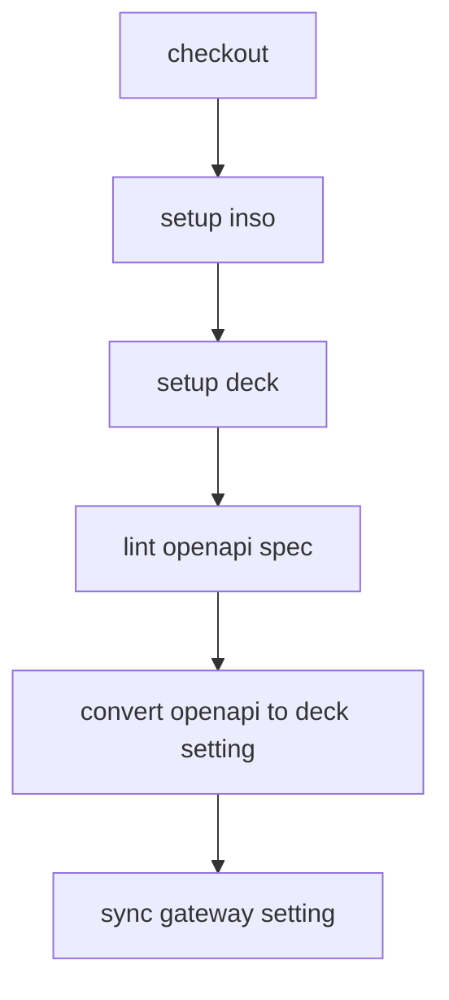

# Konnect APIOps

This is a demonstration for [APIOps](https://developer.konghq.com/deck/apiops/) using Kong Konnect.

## Pipeline overview

This sample provides a simple APIOps pipeline. The overview is as follows.



## How to use

Set secret value to your repo.

```sh
gh secret set KONNECT_TOKEN --body "<your-konnect-token>"
gh secret set KONNECT_CONTROL_PLANE --body "<your-konnect-control-plane-name>"
```
